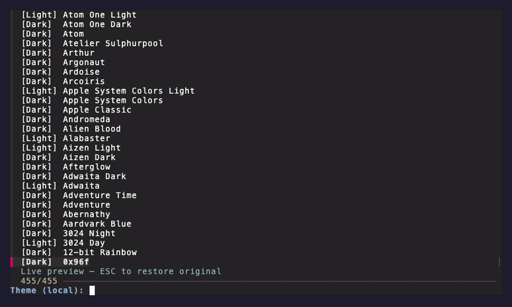

# ghostty-theme-picker

Live theme preview for [Ghostty](https://ghostty.org) using fzf. Browse hundreds of built-in themes and see them applied instantly as you scroll — press Enter to keep, Escape to restore your original.



## Requirements

- [Ghostty](https://ghostty.org) terminal
- [fzf](https://github.com/junegunn/fzf)

## Installation

```sh
git clone https://github.com/Laserducktales/ghostty-theme-picker
cd ghostty-theme-picker
./install.sh
```

Then add the alias to your shell config (`~/.zshrc` or `~/.bashrc`):

```sh
alias gtheme='ghostty-theme-picker'
```

## Usage

```sh
ghostty-theme-picker
```

- **↑ / ↓** — browse themes with live preview
- **Enter** — apply selected theme to the current window
- **Escape** — restore your original theme and exit
- **Type** — fuzzy search theme names

## How it works

Ghostty supports changing terminal colors at runtime via [OSC escape sequences](https://iterm2.com/documentation-escape-codes.html). When you move through the list, fzf calls the script in `--apply` mode which writes these sequences directly to `/dev/tty`, updating colors live without touching your config file.

The change only affects the **current window**. To persist a theme permanently, set it in `~/.config/ghostty/config`:

```
theme = Catppuccin Frappe
```

Ghostty also supports automatic light/dark switching:

```
theme = dark:Catppuccin Frappe,light:Catppuccin Latte
```

## Themes

Ghostty ships with hundreds of themes sourced from [iterm2-color-schemes](https://iterm2colorschemes.com), updated weekly. You can also add custom themes to `~/.config/ghostty/themes/`.

## License

MIT
